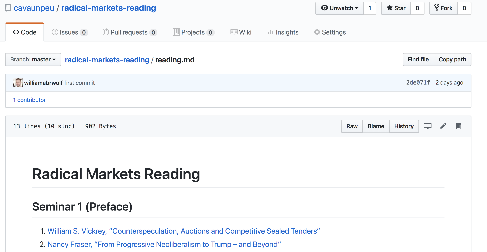

# Radical Markets Reading List

This repository contains links—free where possible and paid where necessary—to the reading materials for Glen Weyl's (Microsoft Research, co-author of [Radical Markets](https://www.amazon.com/Radical-Markets-Uprooting-Capitalism-Democracy/dp/0691177503/ref=sr_1_1?keywords=radical+markets&qid=1556330577&s=gateway&sr=8-1) and visiting professor at Princeton University) Fall 2018 ECON406 class, as found in its [course syllabus](https://www.dropbox.com/s/fjzbpaoiq545s55/Syllabus.pdf?dl=0).

## Contributing

Please add or update links. If you're new to GitHub, you can open a pull request in the web UI as such:

Press the "pencil" icon, next to the trash can icon, in the top-right. From there, follow the on-screen prompts.

**I will approve these pull requests liberally; all help is encouraged.**

Thanks!
